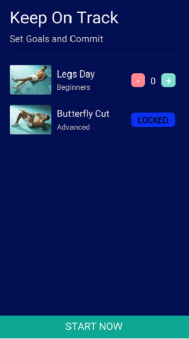

# Yoga-Workout Application
Yoga is one of those activities anyone can do pretty💖 much anywhere, and that’s especially true when you have an app on your smartphone.🦾🙍‍♂️

**Yoga Workout - Yoga for Beginners - Daily Yoga** is best yoga workouts for Beginners and free Yoga workout. Yoga classes includes basic to yoga practice such as: basic asanas, Yoga poses, meditation...Yoga Workout help you to **relax, de-stress and keep you healthy**.

***
# Features of Yoga Workout - Yoga for Beginners - Daily Yoga app:
- Easy to learn and make yoga lessons for beginners yoga.
- Reduce stress, fatigue and relax.
- Daily Yoga at home, no equipment required.
- Timer setting also shows.
- Full of basic yoga exercises.

***
# Screenshots of the application

